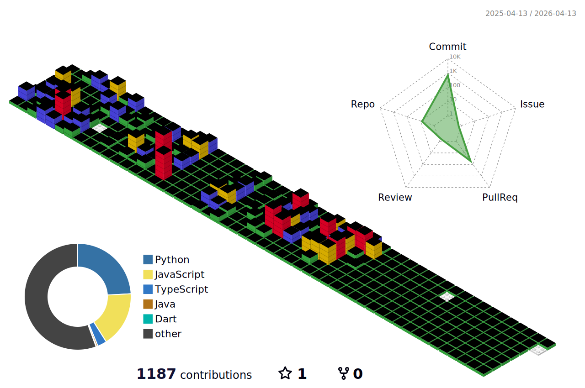

<!-- 헤더 -->
<h1 align="center">🛫 Hi, I'm <strong>Parker</strong> 👋</h1>

  🚀 Building intelligent systems for mobility & smart cities  
  🤖 AI Engineer · 🗺️ GIS Mapping · 🌐 Full-stack Development · 📍 Seoul, South Korea

---

## 💡 About Me

- 💻 I love creating **AI-powered automation** and **geospatial platforms**
- 🔍 Currently focusing on **YOLOv11, MediaPipe, Firebase, PostGIS, GeoServer**
- 📦 Major Projects:
  - `KTS_YOLO`: 실시간 CCTV 킥보드 감지 (YOLOv11 + ByteTrack)
  - `KTS_AI_Analysis`: 전동킥보드 위반 자동 분석 통합 파이프라인
  - `KTS_MediaPipe-LSTM`: 포즈 기반 탑승자 판별
  - `Seoul_Administrative_Map` (Private): QGIS → PostGIS → GeoServer → OpenLayers 기반 서울 행정 지도 구축
  - `Map-Frontend (Vite+Spring)` (Private): OpenLayers 기반 지도 서비스 웹 프론트

---

## 🛠️ Tech Stack

### 💻 Languages
 
 

### 🌐 Web / Scripting / GIS
 
 
 
 
 
 
 
 
  
🗺️ QGIS · PostGIS · GeoServer · OpenLayers

### 🤖 AI / ML / Vision
 
 
   
YOLOv11 · MediaPipe · LSTM · ByteTrack

### ☁️ Cloud / Database
 
 
 

### 🔧 Tools / Dev / IDE / Infra
 
 
 
 
 
 
 
 

---

## 📈 GitHub Stats

  
  

---

## 📬 Contact

  
  
  
  

---

## 🧱 Activity (3D)

  

